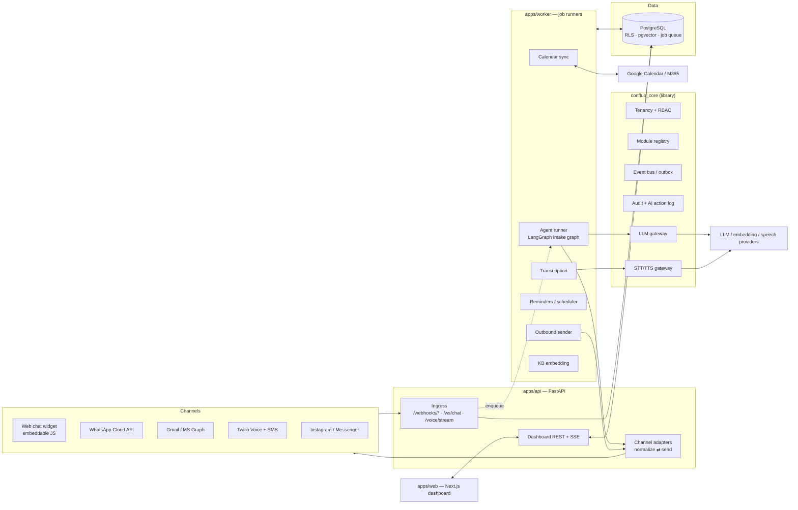
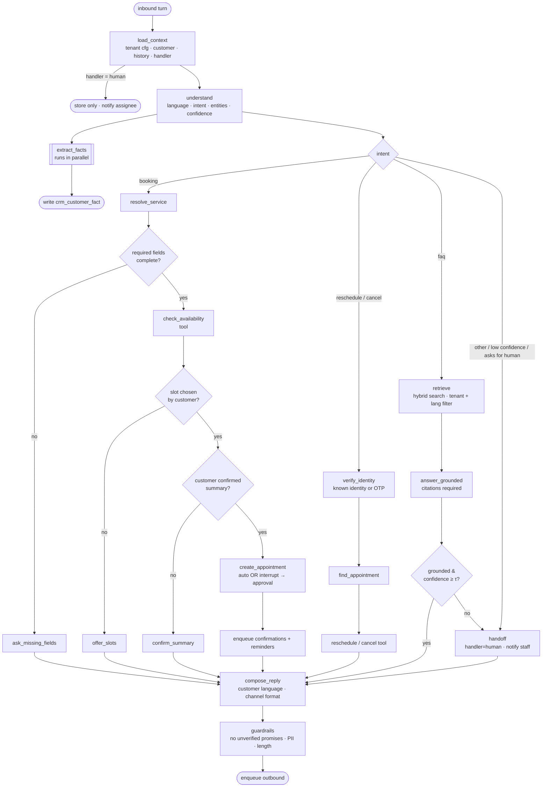

# Confluo — Architecture (v1.0)

Status: **v1.0, open questions decided 2026-10-01** (see §5). No code has been written yet.

---

## 1. System architecture



### Request lifecycle (any channel)

1. **Ingress** verifies the provider signature, writes the raw payload to `inbound_event`
   with a unique key `(provider, external_id)` and returns `200` immediately.
   A duplicate delivery hits the unique key and is a no-op, so the ingress is **idempotent**.
2. In the same transaction a job is enqueued (`process_inbound_event`).
3. The worker calls the **channel adapter**, which normalizes the payload into a
   `Message` on a `Conversation` and resolves or creates the `Customer` via `CustomerIdentity`.
4. If the conversation is AI-handled, the worker runs the **intake graph**.
   Tools perform side effects (book, cancel, write facts). Every step is written to `ai_action`.
5. Replies go to an outbound queue. The adapter sends them and records the delivery status.
6. Failed jobs retry with backoff. After N attempts they are dead-lettered and shown
   in *Settings → System health*, with a manual retry button.

### Key decisions

| Decision | Choice | Why |
|---|---|---|
| Deployable units | `api`, `worker`, `web` (+ static `widget.js`) | Webhooks need fast acks; agent runs and voice processing are slow and must not block them. |
| Job queue | **Postgres-backed** (Procrastinate) | Enqueuing happens in the same transaction as the write (no lost or phantom jobs), no extra infra, and it supports deferred jobs for reminders. We can move to Redis/arq later behind a small interface. |
| Realtime to dashboard | SSE from API, fed by Postgres `LISTEN/NOTIFY` | Simple, works through proxies, enough for inbox updates. |
| Tenancy | Shared schema, `tenant_id` on every row, **Postgres RLS** | DB-level isolation, required by the spec. API/worker connect with a non-owner role that RLS applies to. |
| LLM | `LLMGateway` interface with provider adapters | Models are configurable per task (fast/cheap for classification and extraction, stronger for dialogue). |
| Speech | `STTProvider` / `TTSProvider` interfaces | Swappable. Voice languages are en and de only (no Albanian voice), so any major provider qualifies. |
| Monorepo | Python packages + Next.js in one repo | One CI, shared OpenAPI → generated TS client. |

### Repo layout

```
Confluo/
  apps/
    api/            FastAPI app (thin: wires core + enabled modules)
    worker/         job entrypoint (same codebase, different process)
    web/            Next.js + TS + Tailwind + shadcn/ui dashboard
    widget/         embeddable chat widget (vanilla TS, <30 kB)
  packages/
    core/           confluo_core: tenancy, auth, registry, events, audit, llm, jobs
  modules/
    crm/            confluo_crm: intake agent, channels, booking, KB, customers
  infra/            docker-compose, Dockerfiles, seed data
  docs/
  .github/workflows/
```

---

## 2. Core + module/plugin design

The **core** owns cross-cutting concerns and knows nothing about CRM.
A **module** is a Python package that implements one contract and is discovered via entry points.

```python
class ConfluoModule(Protocol):
    key: str                       # "crm"
    version: str
    depends_on: list[str]          # e.g. ["core"]; later "finance" depends on "crm"
    config_schema: type[BaseModel] # per-tenant config, validated on save
    permissions: list[Permission]  # "crm.inbox.takeover", "crm.kb.edit", ...

    def routers(self) -> list[APIRouter]: ...          # mounted under /api/{key}
    def event_handlers(self) -> dict[str, Handler]: ...# subscribe to domain events
    def jobs(self) -> list[JobDef]: ...                # background + periodic jobs
    def agent_tools(self) -> list[AgentTool]: ...      # tools other agents may use
    def dashboard_manifest(self) -> ModuleManifest: ...# nav items, widgets, settings pages
    migrations_path: Path                              # Alembic branch for this module
```

**Rules that keep it modular while sharing one database**

- **Tables are namespaced** (`crm_appointment`, later `fin_invoice`). Modules may
  foreign-key to core tables (`tenant`, `customer`), but never write another module's tables.
- **Cross-module communication goes through domain events** (transactional outbox) and
  explicit service interfaces. Example: `crm.appointment.completed` → Finance creates a draft invoice.
- **`customer` lives in core, not in CRM.** Finance, Projects and others will all
  need it. CRM extends it with facts, identities and conversations.
- **Per-tenant enablement:** `tenant_module(tenant_id, module_key, enabled, config jsonb, version)`.
  A dependency on `require_module("crm")` returns 404 for disabled modules. The dashboard
  builds its nav from `GET /api/me/manifest`.
- **Customization without forks**, layered: code defaults → module `config_schema` →
  tenant config → **custom field definitions** (`field_definition` + `custom_fields jsonb`
  on extensible entities). Industry presets (clinic, salon, workshop) are just seed
  bundles of config + fields + KB templates.
- **Migrations:** one Alembic environment, one branch per module, so tables appear
  only when the module is installed in the deployment.

---

## 3. Data model

Changes from your starting point are marked **(new)** or **(changed)**.
Every tenant-scoped table has `tenant_id uuid not null`, `created_at`, `updated_at`
and an RLS policy `tenant_id = current_setting('app.tenant_id')::uuid`.

### Core

| Table | Key columns | Notes |
|---|---|---|
| `tenant` | id, name, slug, default_locale, timezone, plan, data_region | |
| `app_user` | id (= auth provider id), email, name, locale | global; one person can belong to several tenants |
| `tenant_member` **(new)** | tenant_id, user_id, role, status | replaces `User/Staff`; supports accountants or agencies managing several businesses |
| `role_permission` | tenant_id, role, permission | defaults seeded; tenant-editable later |
| `location` **(new)** | name, address, timezone, opening_hours jsonb | SMEs often have 2–3 sites; hours and timezone live here |
| `tenant_module` | module_key, enabled, config jsonb, version | replaces `ModuleConfig` |
| `field_definition` **(new)** | entity, key, label_i18n jsonb, type, validation jsonb, pii_level | powers required booking fields and custom fields |
| `customer` | display_name, first_name, last_name, preferred_language, status, merged_into_id, custom_fields jsonb | core-owned |
| `customer_identity` | customer_id, type (phone/email/wa/ig/fb/web_session), value_normalized, verified, source_channel | unique `(tenant_id, type, value_normalized)` where verified |
| `consent` **(new)** | customer_id, purpose (marketing/recording/processing), granted, channel, text_version, evidence jsonb, at | GDPR |
| `audit_log` | actor_type (user/ai/system), actor_id, action, entity, entity_id, diff jsonb, ip | append-only (no UPDATE/DELETE grant) |
| `ai_action` **(new)** | run_id, conversation_id, node, tool, input jsonb, output jsonb, rationale, sources jsonb, model, tokens, latency_ms, confidence, outcome, approval_status, approved_by | powers "why did the AI do this?" |
| `inbound_event` **(new)** | provider, external_id, payload jsonb, status, attempts, last_error | webhook ledger; unique `(provider, external_id)` |
| `outbox_event` **(new)** | type, payload, published_at | domain events |
| `notification` | user_id, kind, payload, read_at, delivered_via | |
| `data_subject_request` **(new)** | customer_id, type (export/erase), status, completed_at, artifact_url | right to access / erasure |

### CRM module

| Table | Key columns | Notes |
|---|---|---|
| `crm_channel_connection` **(new)** | channel, external_account_id, credentials_ref, status, settings jsonb | maps an incoming webhook to a tenant; secrets stored encrypted (pgsodium/KMS), never in plain columns |
| `crm_customer_fact` **(changed)** | customer_id, key, value jsonb, source_channel, source_message_id, extracted_by (ai/staff), confidence, status (active/superseded/rejected/pending_review), sensitivity | facts are superseded, never overwritten, so history survives |
| `crm_match_candidate` **(new)** | customer_a, customer_b, score, signals jsonb, status, resolved_by | uncertain matches waiting for review |
| `crm_conversation` | customer_id, channel, channel_connection_id, status (open/waiting/closed), handler (ai/human), assigned_member_id, language, last_message_at | `id` doubles as the LangGraph thread id |
| `crm_message` | conversation_id, direction, sender_type (customer/ai/staff/system), body, content_type, attachments jsonb, external_id, delivery_status | unique `(channel_connection_id, external_id)` |
| `crm_call` **(new)** | conversation_id, mode (receptionist/assist), twilio_sid, consent_played_at, recording_ref, transcript jsonb, duration | voice-specific |
| `crm_service` | name_i18n, duration_min, buffer_before/after, price, active | |
| `crm_service_field` **(changed)** | service_id, field_definition_id, required, order | normalized `required_fields` |
| `crm_resource` **(changed)** | kind (staff/room/equipment), member_id?, location_id, name | replaces `Resource/StaffAvailability` |
| `crm_service_resource` **(new)** | service_id, resource_id | who or what can perform a service |
| `crm_availability_rule` **(new)** | resource_id, weekday, start, end, valid_from/to | recurring weekly schedule |
| `crm_availability_exception` **(new)** | resource_id, during tstzrange, kind (off/extra) | holidays, sick days |
| `crm_appointment` | customer_id, service_id, resource_id, during tstzrange, status (pending_approval/confirmed/cancelled/no_show/completed), source (ai/staff/online), field_values jsonb, conversation_id, external_event_id | **exclusion constraint** on `(resource_id, during)` for active statuses, so double booking is impossible even under race conditions |
| `crm_calendar_connection` **(new)** | member_id/resource_id, provider, calendar_id, sync_token, credentials_ref | |
| `crm_external_busy` **(new)** | resource_id, during, external_event_id | cached free/busy from Google/M365 |
| `crm_reminder` **(new)** | appointment_id, send_at, channel, status | backed by deferred jobs |
| `crm_knowledge_item` | kind (faq/service/policy/hours/location/free_text), title, body, language, published | edited in the dashboard |
| `crm_knowledge_chunk` **(new)** | knowledge_item_id, language, content, embedding vector, tsv tsvector | hybrid search (vector + full-text) |

---

## 4. LangGraph intake graph

**Execution model:** one graph run per inbound customer turn, with `thread_id = conversation_id`
and a Postgres checkpointer. Dialogue progress (which fields are collected, which slots were
offered) lives in graph state, so a conversation can pause for days and resume on any
worker. `interrupt()` is used only for **staff approval** (approval mode), never to wait for the customer.

**The LLM interprets and phrases; code decides.** Availability, slot validity, booking
and cancellation are deterministic tools. The LLM cannot create a slot that the
availability engine did not return.



### State (abridged)

```python
class IntakeState(TypedDict):
    tenant_id: UUID; conversation_id: UUID; customer_id: UUID | None
    channel: Channel; language: str
    messages: Annotated[list[AnyMessage], add_messages]
    intent: Intent | None; intent_confidence: float
    booking: BookingDraft | None   # service_id, field_values, offered_slots, chosen_slot, confirmed
    kb_hits: list[KBHit]
    handoff_reason: str | None
    pending_actions: list[ToolCall]   # side effects to run after reply composition
```

### Details

- **Intent switching:** a customer can change topics mid-booking ("actually, what are your
  prices?"). `understand` runs on every turn. The booking draft persists, so after the
  FAQ answer the agent offers to continue the booking.
- **Fact extraction** returns structured `{key, value, confidence, evidence_span}`.
  Facts below a threshold, and any **special-category data** (health, for example
  allergies), are stored as `pending_review` unless the tenant enabled auto-accept and
  recorded a legal basis.
- **Customer matching:** deterministic on verified phone or email (exact normalized match).
  A probabilistic score (name + partial contact) creates a `crm_match_candidate` and is
  never auto-merged.
- **Channel formatting:** `compose_reply` gets channel constraints (voice: short and
  speakable, with options read as "press 1 or say…"; SMS: under 320 characters;
  email: full, with greeting and signature).
- **Voice:** the same graph runs per utterance. Speed comes from a faster model tier,
  prompt caching, and filler phrases while tools run. DTMF input is mapped to intents
  before `understand`.
- **Explainability:** a node decorator writes an `ai_action` row with input, output,
  rationale, sources and model, so the dashboard can show the trace per message.

### Testing agent flows

- `tests/flows/*.yaml`: scripted conversations (customer turns + expected intent, tool
  calls, final appointment state, handoff yes/no) per language.
- Two modes:
  - **Deterministic (CI):** fake LLM with recorded responses. Fast, runs on every PR.
  - **Eval (nightly/manual):** real models, with assertions on outcomes rather than exact wording.

---

## 5. Decisions (v1.0, 2026-10-01)

| # | Question | Decision |
|---|---|---|
| 1 | Supabase vs plain Postgres + own auth | **Supabase**, EU region: Postgres 17, Auth, pgvector, RLS. Local dev runs the Supabase CLI stack in Docker. |
| 2 | Availability source of truth | **Confluo's own schedules** (`crm_availability_rule` / `_exception`) **minus external busy times** cached in `crm_external_busy`. External calendars never define open slots. |
| 3 | Pilot vertical: health/clinics? | **No.** The pilot is a non-clinical business, so no GDPR Art. 9 data at launch. Special-category handling (`pending_review`, legal basis) stays in the design for later. |
| 4 | Albanian voice in the first voice release? | **No Albanian voice at all.** Voice supports en and de. Albanian stays for text channels and the dashboard. |
| 5 | Identity verification before reschedule/cancel | **Yes.** A known verified identity on the same channel is enough; otherwise an OTP is sent to a verified phone or email on file. |
| 6 | LLM + embedding provider | **Claude** via `LLMGateway`: a fast tier for intent and extraction, a stronger tier for dialogue. Embeddings from **Voyage AI** (voyage-3.5, 1024 dims, decided 2026-10-01) behind the same gateway. |
| 7 | Dashboard languages | **en, nl, fr, de, sq** (2026-10-01). Belgium is the first market, so Dutch and French were added. |
| 8 | Hosting region | Supabase project in **Ireland (eu-west-1)**; API and worker go next to it. |

### Other defaults

- Dashboard i18n via next-intl (languages in decision 7).
- Schema: see the generated [ERD](ERD.md). Tenant-scoped tables reference each other with
  composite `(tenant_id, id)` foreign keys, so no row can point into another tenant.
- CI: GitHub Actions running ruff, mypy, pytest (with a Postgres service), eslint,
  tsc and the Next build.
- Deployment target decided at M2. Docker images are portable.
