# Confluo — Entity relationship diagram

Generated from the migrated schema by `scripts/generate_erd.py`; do not edit by hand
(`make erd` regenerates it, and a test fails when it's stale).

Every table except `tenant` and `app_user` has a `tenant_id` referencing `tenant`;
those links are left out to keep the diagrams readable. Columns marked FK are part
of a composite `(tenant_id, id)` foreign key where the target is tenant-scoped.

## Core

```mermaid
erDiagram
  ai_action {
    uuid id PK
    uuid tenant_id
    uuid run_id
    uuid conversation_id "nullable"
    text node
    text tool "nullable"
    jsonb input
    jsonb output
    text rationale "nullable"
    jsonb sources
    text model "nullable"
    int4 input_tokens "nullable"
    int4 output_tokens "nullable"
    int4 latency_ms "nullable"
    float4 confidence "nullable"
    text outcome "nullable"
    text approval_status
    uuid approved_by FK
    timestamptz created_at
  }
  app_user {
    uuid id PK
    text email
    text name "nullable"
    text locale "nullable"
    timestamptz created_at
    timestamptz updated_at
  }
  audit_log {
    int8 id PK
    uuid tenant_id
    text actor_type
    uuid actor_id "nullable"
    text action
    text entity
    text entity_id "nullable"
    jsonb diff
    inet ip "nullable"
    timestamptz at
  }
  consent {
    uuid id PK
    uuid tenant_id
    uuid customer_id FK
    text purpose
    bool granted
    text channel "nullable"
    text text_version "nullable"
    jsonb evidence
    timestamptz at
  }
  customer {
    uuid id PK
    uuid tenant_id
    text display_name "nullable"
    text first_name "nullable"
    text last_name "nullable"
    text preferred_language "nullable"
    text status
    uuid merged_into_id FK
    jsonb custom_fields
    timestamptz created_at
    timestamptz updated_at
  }
  customer_identity {
    uuid id PK
    uuid tenant_id
    uuid customer_id FK
    text type
    text value_normalized
    bool verified
    text source_channel "nullable"
    timestamptz created_at
  }
  data_subject_request {
    uuid id PK
    uuid tenant_id
    uuid customer_id FK
    text type
    text status
    uuid requested_by FK
    timestamptz completed_at "nullable"
    text artifact_url "nullable"
    timestamptz created_at
    timestamptz updated_at
  }
  field_definition {
    uuid id PK
    uuid tenant_id
    text entity
    text key
    jsonb label_i18n
    text type
    jsonb options
    jsonb validation
    text pii_level
    int4 position
    timestamptz archived_at "nullable"
    timestamptz created_at
    timestamptz updated_at
  }
  inbound_event {
    uuid id PK
    uuid tenant_id "nullable"
    text provider
    text external_id
    jsonb payload
    jsonb headers
    text status
    int4 attempts
    text last_error "nullable"
    timestamptz received_at
    timestamptz processed_at "nullable"
  }
  job_error {
    int8 job_id PK
    uuid tenant_id
    text task_name
    int4 attempts
    text error
    timestamptz failed_at
  }
  llm_usage {
    int8 id PK
    uuid tenant_id
    text purpose
    text tier
    text provider
    text model
    int4 input_tokens
    int4 output_tokens
    int4 cache_read_tokens
    int4 cache_write_tokens
    int4 latency_ms "nullable"
    numeric cost_usd "nullable"
    uuid run_id "nullable"
    timestamptz created_at
  }
  location {
    uuid id PK
    uuid tenant_id
    text name
    text address "nullable"
    text timezone "nullable"
    jsonb opening_hours
    timestamptz created_at
    timestamptz updated_at
  }
  notification {
    uuid id PK
    uuid tenant_id
    uuid user_id FK
    text kind
    jsonb payload
    timestamptz read_at "nullable"
    text[] delivered_via
    timestamptz created_at
  }
  outbox_event {
    int8 id PK
    uuid tenant_id
    text type
    jsonb payload
    timestamptz created_at
    timestamptz published_at "nullable"
  }
  tenant {
    uuid id PK
    text name
    text slug
    text default_locale
    text timezone
    timestamptz created_at
    timestamptz updated_at
  }
  tenant_invitation {
    uuid id PK
    uuid tenant_id
    text email
    text role
    uuid invited_by FK
    timestamptz created_at
    timestamptz expires_at
    timestamptz accepted_at "nullable"
    uuid accepted_by FK
    timestamptz revoked_at "nullable"
    timestamptz updated_at
  }
  tenant_member {
    uuid tenant_id PK
    uuid user_id PK,FK
    text role
    text status
    timestamptz created_at
    timestamptz updated_at
  }
  tenant_module {
    uuid tenant_id PK
    text module_key PK
    bool enabled
    jsonb config
    text version "nullable"
    timestamptz created_at
    timestamptz updated_at
  }
  app_user ||--o{ ai_action : "approved_by"
  app_user ||--o{ data_subject_request : "requested_by"
  app_user ||--o{ notification : "user_id"
  app_user ||--o{ tenant_invitation : "accepted_by"
  app_user ||--o{ tenant_invitation : "invited_by"
  app_user ||--o{ tenant_member : "user_id"
  customer ||--o{ consent : "customer_id"
  customer ||--o{ customer : "merged_into_id"
  customer ||--o{ customer_identity : "customer_id"
  customer ||--o{ data_subject_request : "customer_id"
```

## CRM module

```mermaid
erDiagram
  crm_appointment {
    uuid id PK
    uuid tenant_id
    uuid customer_id FK
    uuid service_id FK
    uuid resource_id FK
    tstzrange during
    text status
    text source
    jsonb field_values
    uuid conversation_id FK
    text external_event_id "nullable"
    timestamptz created_at
    timestamptz updated_at
  }
  crm_availability_exception {
    uuid id PK
    uuid tenant_id
    uuid resource_id FK
    tstzrange during
    text kind
    text reason "nullable"
    timestamptz created_at
  }
  crm_availability_rule {
    uuid id PK
    uuid tenant_id
    uuid resource_id FK
    int2 weekday
    time start_time
    time end_time
    date valid_from "nullable"
    date valid_to "nullable"
    timestamptz created_at
  }
  crm_calendar_connection {
    uuid id PK
    uuid tenant_id
    uuid resource_id FK
    text provider
    text calendar_id
    text sync_token "nullable"
    text credentials_ref "nullable"
    timestamptz created_at
    timestamptz updated_at
  }
  crm_call {
    uuid id PK
    uuid tenant_id
    uuid conversation_id FK
    text mode
    text twilio_sid "nullable"
    timestamptz consent_played_at "nullable"
    text recording_ref "nullable"
    jsonb transcript
    int4 duration_s "nullable"
    timestamptz created_at
  }
  crm_channel_connection {
    uuid id PK
    uuid tenant_id
    text channel
    text external_account_id
    text credentials_ref "nullable"
    text status
    jsonb settings
    timestamptz created_at
    timestamptz updated_at
  }
  crm_conversation {
    uuid id PK
    uuid tenant_id
    uuid customer_id FK
    text channel
    uuid channel_connection_id FK
    text status
    text handler
    uuid assigned_member_id FK
    text language "nullable"
    timestamptz last_message_at "nullable"
    timestamptz created_at
    timestamptz updated_at
  }
  crm_customer_fact {
    uuid id PK
    uuid tenant_id
    uuid customer_id FK
    text key
    jsonb value
    text source_channel "nullable"
    uuid source_message_id FK
    text extracted_by
    float4 confidence "nullable"
    text status
    text sensitivity
    timestamptz created_at
  }
  crm_external_busy {
    uuid id PK
    uuid tenant_id
    uuid resource_id FK
    uuid calendar_connection_id FK
    tstzrange during
    text external_event_id
  }
  crm_knowledge_chunk {
    uuid id PK
    uuid tenant_id
    uuid knowledge_item_id FK
    text language
    int4 position
    text content
    vector embedding "nullable"
    tsvector tsv "nullable"
    timestamptz created_at
    text embedding_model "nullable"
  }
  crm_knowledge_item {
    uuid id PK
    uuid tenant_id
    text kind
    text title
    text body
    text language
    bool published
    timestamptz published_at "nullable"
    timestamptz embedded_at "nullable"
    timestamptz created_at
    timestamptz updated_at
  }
  crm_match_candidate {
    uuid id PK
    uuid tenant_id
    uuid customer_a FK
    uuid customer_b FK
    float4 score
    jsonb signals
    text status
    uuid resolved_by FK
    timestamptz created_at
    timestamptz updated_at
  }
  crm_message {
    uuid id PK
    uuid tenant_id
    uuid conversation_id FK
    uuid channel_connection_id FK
    text direction
    text sender_type
    uuid sender_member_id FK
    text body "nullable"
    text content_type
    jsonb attachments
    text external_id "nullable"
    text delivery_status "nullable"
    timestamptz created_at
  }
  crm_reminder {
    uuid id PK
    uuid tenant_id
    uuid appointment_id FK
    timestamptz send_at
    text channel
    text status
    timestamptz created_at
  }
  crm_resource {
    uuid id PK
    uuid tenant_id
    text kind
    uuid member_id FK
    uuid location_id FK
    text name
    bool active
    timestamptz created_at
    timestamptz updated_at
  }
  crm_service {
    uuid id PK
    uuid tenant_id
    jsonb name_i18n
    jsonb description_i18n
    int4 duration_min
    int4 buffer_before_min
    int4 buffer_after_min
    int4 price_cents "nullable"
    text currency
    bool active
    int4 position
    timestamptz created_at
    timestamptz updated_at
  }
  crm_service_field {
    uuid tenant_id
    uuid service_id PK,FK
    uuid field_definition_id PK,FK
    bool required
    int4 position
  }
  crm_service_resource {
    uuid tenant_id
    uuid service_id PK,FK
    uuid resource_id PK,FK
  }
  app_user ||--o{ crm_conversation : "assigned_member_id"
  app_user ||--o{ crm_match_candidate : "resolved_by"
  app_user ||--o{ crm_message : "sender_member_id"
  app_user ||--o{ crm_resource : "member_id"
  crm_appointment ||--o{ crm_reminder : "appointment_id"
  crm_calendar_connection ||--o{ crm_external_busy : "calendar_connection_id"
  crm_channel_connection ||--o{ crm_conversation : "channel_connection_id"
  crm_channel_connection ||--o{ crm_message : "channel_connection_id"
  crm_conversation ||--o{ crm_appointment : "conversation_id"
  crm_conversation ||--o{ crm_call : "conversation_id"
  crm_conversation ||--o{ crm_message : "conversation_id"
  crm_knowledge_item ||--o{ crm_knowledge_chunk : "knowledge_item_id"
  crm_message ||--o{ crm_customer_fact : "source_message_id"
  crm_resource ||--o{ crm_appointment : "resource_id"
  crm_resource ||--o{ crm_availability_exception : "resource_id"
  crm_resource ||--o{ crm_availability_rule : "resource_id"
  crm_resource ||--o{ crm_calendar_connection : "resource_id"
  crm_resource ||--o{ crm_external_busy : "resource_id"
  crm_resource ||--o{ crm_service_resource : "resource_id"
  crm_service ||--o{ crm_appointment : "service_id"
  crm_service ||--o{ crm_service_field : "service_id"
  crm_service ||--o{ crm_service_resource : "service_id"
  customer ||--o{ crm_appointment : "customer_id"
  customer ||--o{ crm_conversation : "customer_id"
  customer ||--o{ crm_customer_fact : "customer_id"
  customer ||--o{ crm_match_candidate : "customer_a"
  customer ||--o{ crm_match_candidate : "customer_b"
  field_definition ||--o{ crm_service_field : "field_definition_id"
  location ||--o{ crm_resource : "location_id"
```

